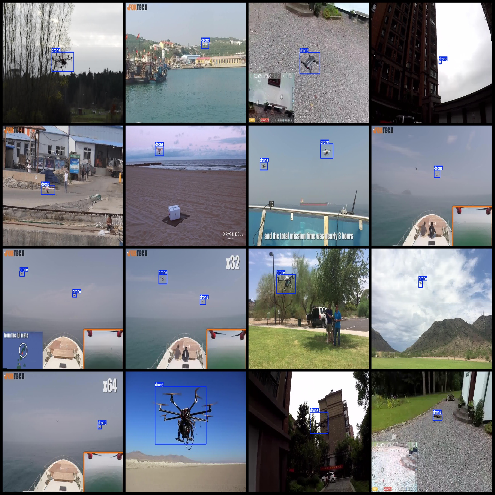

# Drone Anti-Drone Identification and Detection Data Set VOC+YOLO Format with 2,863 1-class Images

Dataset format: Pascal VOC format + YOLO format (txt file without split path, only contains jpg images and corresponding VOC format xml file and yolo format txt file)
The number of jpg files: 2863.
Annotation count (XML file count): 2863
annotation count: 2863  
annotationnumber of classes: 1  
annotation class names:["drone"]  
boxes per class:   
drone box count = 3340  
total boxes: 3340  
"image resolution: multi-resolution image, such as 640x480, 1280x720, etc."
To use the `labelImg` tool, you need to have the LabelImg library installed. You can install it using pip:

```bash
pip install labelImg
```

Once you have the library installed, you can use the `labelImg` tool by calling it from your Python script or Jupyter notebook. Here's an example of how to use it:

```python
import labelImg

# Assuming you have a PIL Image object called 'image'
labelImg.imshow(image)
```

In the above code, replace `image` with the path to your image file. The `imshow` function will display the image in a window and show the labels on top of the image.
Annotation rule: Draw a rectangle around the class.
Important notes: The dataset does not have a split into training, validation, and test sets. You need to manually split it yourself.
This dataset does not guarantee the accuracy of the trained models or weights file.
Image preview:
## Images




Here is a pay link on Stripe ( https://buy.stripe.com/3cs8yP7sY87d0vu9AB ). Please contact me lonlonago@foxmail.com after funding $89, and I will send you a complete data files , thank you!

